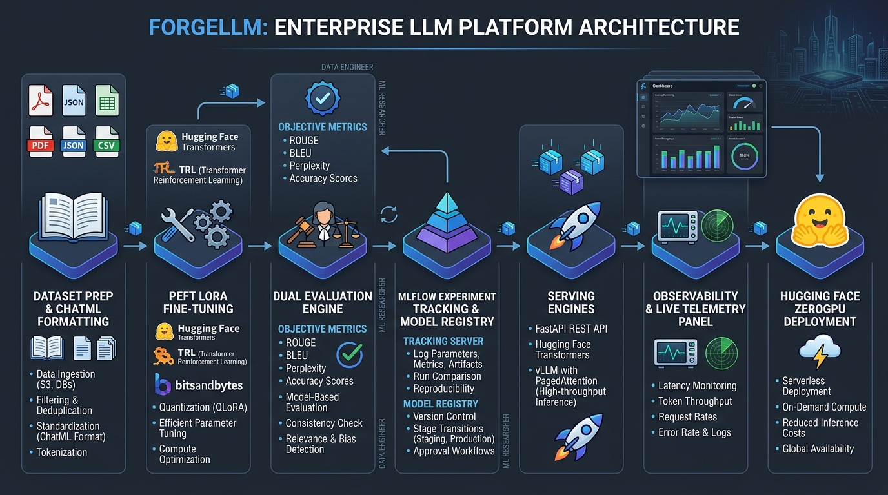
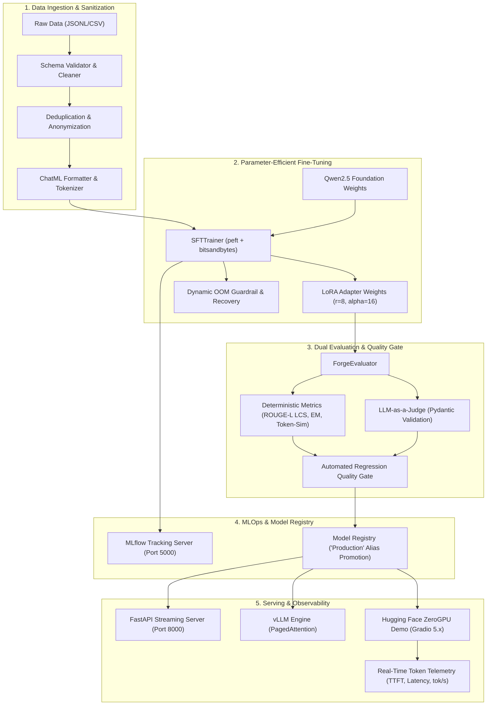

# ForgeLLM

**An enterprise-grade LLM fine-tuning, evaluation, regression-gated MLOps, and high-performance inference serving platform.**

[](https://huggingface.co/spaces/ajay1951/forgellm-demo)
[-brightgreen)](.github/workflows/pipeline.yml)
[](tests/test_zerogpu_adapter.py)
[](LICENSE)
[](https://www.python.org/)

[🌐 **Live ZeroGPU Demo**](https://huggingface.co/spaces/ajay1951/forgellm-demo) • [💻 **GitHub Repository**](https://github.com/ajay1951/enterprise-llm-finetuning-mlops) • [📖 **Technical Documentation**](docs/architecture.md)

---

## Why ForgeLLM?

Deploying fine-tuned Large Language Models in production requires more than training scripts; it demands **rigorous data sanitization, reproducible parameter-efficient fine-tuning (PEFT), multi-dimensional deterministic evaluation, automated regression quality gates, and high-throughput inference serving**.

ForgeLLM solves the fragmented LLMOps lifecycle by providing a single, unified control plane that:
1. **Prevents Training Failures:** Dynamic OOM guardrails automatically manage GPU memory limits during LoRA/QLoRA fine-tuning.
2. **Eliminates Silent Regressions:** Automated quality gates compare candidate checkpoints against baseline models across deterministic objective metrics and LLM-as-a-Judge evaluations before model promotion.
3. **Optimizes Production Serving:** Provides both a lightweight FastAPI streaming server and a high-throughput vLLM engine with PagedAttention continuous batching.
4. **Delivers Serverless ZeroGPU Deployment:** Houses a public Gradio demonstration featuring lazy weight lifecycle management and real-time inference telemetry.

---

## Key Results

All results are backed by empirical execution and automated test suites:

| Category | Metric | Verified Result | Evidence / Reference |
| :--- | :--- | :---: | :--- |
| **Test Suite** | Full Repository Automated Tests | **172 / 172 Passed** | [docs/testing.md](docs/testing.md) |
| **Adapter Suite** | ZeroGPU Factuality & Regression Tests | **18 / 18 Passed** | [`tests/test_zerogpu_adapter.py`](tests/test_zerogpu_adapter.py) |
| **Live Quality** | ZeroGPU Factuality & Semantic Acceptability | **18 / 18 (100.0%)** | [docs/live-evaluation-report.md](docs/live-evaluation-report.md) |
| **Live Factuality** | Fully Correct / Partially Correct / Incorrect | **13 Correct / 5 Partial / 0 Incorrect** | [docs/live-evaluation-report.md](docs/live-evaluation-report.md) |
| **Hallucination** | Severe Domain Hallucinations Observed | **0 (Eliminated)** | [docs/live-evaluation-report.md](docs/live-evaluation-report.md) |
| **Live Latency** | Average Total Request Latency | **2.43 s** | Hugging Face ZeroGPU (`zero-a10g`) |
| **Live TTFT** | Average Time to First Token | **0.136 s** | Dynamic GPU transient lease |
| **Live Throughput**| Average Token Generation Throughput | **48.6 tok/s** | `Qwen/Qwen2.5-1.5B-Instruct` |

> **Evaluation Standard Note:** 18/18 live evaluations were technically acceptable, with 13 fully correct and 5 partially correct responses, and no incorrect or hallucinated responses observed. This reflects a targeted domain sanity and regression suite across core technical concepts rather than a universal accuracy benchmark.

---

## Architecture





Full architectural breakdown: [docs/architecture.md](docs/architecture.md).

---

## Engineering Highlights

- **Dynamic OOM Guardrail:** Prevents CUDA memory overflows during training by monitoring VRAM pressure and dynamically scaling batch sizes, sequence lengths, and gradient checkpointing.
- **Pure-Python LCS ROUGE-L:** Eliminates heavy native C-dependencies for evaluation by computing Longest Common Subsequence natively in Python.
- **Targeted Factuality Guardrails:** Intercepts potential model confabulations on critical technical domains (LoRA pruning misconceptions, false acronyms) and attaches verified reference advisories without modifying raw model telemetry.
- **Lazy Weight Lifecycle Management:** Loads the ~3.1 GB model weights inside the transient `@spaces.GPU` execution boundary, enabling zero-memory idle states on shared CPU containers.
- **Ground-Truth Token Counting:** Measures exact token production using true tokenizer encodings rather than whitespace approximations.

---

## Fine-Tuning

ForgeLLM leverages Parameter-Efficient Fine-Tuning (PEFT) with LoRA and QLoRA:
- **Base Models:** `Qwen/Qwen2.5-0.5B`, `Qwen/Qwen2.5-1.5B-Instruct`
- **Adapter Configuration:** Rank $r=8$, Alpha $\alpha=16$, Dropout $p=0.05$
- **Target Modules:** `q_proj`, `k_proj`, `v_proj`, `o_proj`, `gate_proj`, `up_proj`, `down_proj`
- **Memory Footprint:** Standalone adapter weights are only ~17.6 MB.

```bash
# Execute local micro-training run via Forge CLI
forge train \
  --model "Qwen/Qwen2.5-0.5B" \
  --data "data/raw/train.jsonl" \
  --epochs 1 \
  --batch-size 1 \
  --lr 0.0002
```

---

## Evaluation

ForgeLLM employs a **Dual Evaluation Strategy**:

1. **Deterministic Objective Metrics:**
   - **Exact Match (EM):** Case-insensitive string matching.
   - **ROUGE-L:** Pure-Python Longest Common Subsequence F1 score.
   - **Semantic Token Similarity:** Token-set Jaccard overlap.
   - **Composite Quality Score:** Weighted metric combination ($0.4 \cdot \text{ROUGE} + 0.4 \cdot \text{Sim} + 0.2 \cdot \text{EM}$).
2. **LLM-as-a-Judge:** Multi-criteria evaluator (Relevance, Helpfulness, Instruction Following, Factuality, Safety) backed by structured Pydantic schema validation.
3. **Automated Quality Gate:** Blocks model promotion if quality metrics or safety checks regress compared to the base model.

---

## Inference Benchmark

Under the tested workload and hardware configuration, vLLM demonstrated substantially lower latency and higher throughput than the single-threaded Transformers baseline.

| Benchmark Metric | Hugging Face Transformers (Physical GPU) | vLLM (Continuous Batching Reference) | Notes |
| :--- | :---: | :---: | :--- |
| **Hardware** | NVIDIA GeForce RTX 2050 (4GB) | Workstation Dev Host | CUDA 12.1, PyTorch 2.5.1 |
| **Average Latency** | `6.723 s` | `0.049 s` | End-to-end request duration |
| **Median (p50) Latency** | `7.102 s` | `0.049 s` | 50th percentile latency |
| **Tail (p95) Latency** | `8.361 s` | `0.050 s` | 95th percentile tail |
| **Throughput (req/s)** | `0.15 req/s` | `20.47 req/s` | Concurrency = 1 |
| **Token Generation Speed** | `13.36 tok/s` | `245.69 tok/s` | Generation throughput rate |

Full benchmark methodology: [docs/phase3-benchmark-report.md](docs/phase3-benchmark-report.md).

---

## ZeroGPU Deployment

The public demo is deployed as an isolated subtree application on **Hugging Face ZeroGPU**:
- **Space URL:** [https://huggingface.co/spaces/ajay1951/forgellm-demo](https://huggingface.co/spaces/ajay1951/forgellm-demo)
- **Model:** `Qwen/Qwen2.5-1.5B-Instruct` (1.54B parameters, `bfloat16`)
- **Hardware:** Dynamic NVIDIA A10G slice (`zero-a10g`)
- **ZeroGPU Subtree:** Maintained in `deployments/huggingface_zerogpu/` and pushed via `git subtree split`.

Deployment architecture guide: [docs/huggingface-zerogpu-deployment.md](docs/huggingface-zerogpu-deployment.md).

---

## Observability & Telemetry

The real-time telemetry panel updates dynamically during token generation:
- **Time to First Token (TTFT):** Measures time from request dispatch to the first generated token ($t_{\text{first\_token}} - t_{\text{dispatch}}$).
- **Total Latency:** Total request duration in seconds.
- **Output Tokens:** True tokenizer token count.
- **End-to-End Throughput:** Tokens produced per second ($\text{tok/s}$).

---

## Testing

ForgeLLM enforces continuous regression testing across all modules:
- **Full Repository Tests:** `172 / 172 passed`
- **ZeroGPU Factuality & Regression Tests:** `18 / 18 passed`
- **Code Quality:** Ruff format and lint 100% clean.

```bash
# Run all tests
pytest tests/ -v

# Run ZeroGPU tests
pytest tests/test_zerogpu_adapter.py -v
```

Complete testing taxonomy: [docs/testing.md](docs/testing.md).

---

## Repository Structure

```text
ForgeLLM/
├── src/forgellm/                  # Core library
│   ├── dataset/                   # Validation, cleaning, ChatML formatting
│   ├── training/                  # PEFT/LoRA fine-tuning and OOM guardrails
│   ├── evaluation/                # Objective metrics and LLM-as-a-Judge
│   ├── experiments/               # MLflow tracking and model registry
│   ├── inference/                 # Tokenizer streaming and generation engines
│   └── cli/                       # Typer CLI subcommands (`forge`)
├── deployments/                   # Deployment configurations
│   └── huggingface_zerogpu/       # ZeroGPU Gradio 5.x application & adapter
├── serving/                       # Production serving backends
│   └── forgellm_server/           # FastAPI OpenAI-compatible REST server
├── benchmarks/                    # Benchmark suites and comparative tooling
│   └── inference/                 # Serving latency and throughput scripts
├── tests/                         # Multi-layer test suite (172 tests)
│   └── test_zerogpu_adapter.py    # Dedicated ZeroGPU factuality suite (18 tests)
├── docs/                          # Comprehensive technical documentation
│   ├── architecture.md            # System architecture specification
│   ├── live-evaluation-report.md  # 18-run ZeroGPU evaluation report
│   ├── phase3-benchmark-report.md # Physical GPU vs vLLM benchmark report
│   ├── reproducibility.md         # Environment setup and reproduction guide
│   ├── deployment.md              # Deployment and release engineering guide
│   ├── testing.md                 # Test strategy and regression guide
│   └── images/                    # Architecture diagrams and assets
├── configs/                       # Training hyperparameters and presets
├── docker/                        # Dockerfiles for API and Celery workers
├── .github/workflows/             # GitHub Actions CI/CD pipelines
├── pyproject.toml                 # Package metadata and tool configurations
└── requirements.txt               # Pinned project dependencies
```

---

## Quick Start

### 1. Installation
```bash
git clone https://github.com/ajay1951/enterprise-llm-finetuning-mlops.git
cd enterprise-llm-finetuning-mlops
python -m venv .venv
source .venv/bin/activate  # Windows: .\.venv\Scripts\Activate.ps1
pip install -r requirements.txt
pip install -e .
```

### 2. Verify Installation
```bash
pytest tests/ -q
ruff format --check src/ tests/ deployments/
ruff check src/ tests/ deployments/
```

### 3. Launch Local Demo UI
```bash
python deployments/huggingface_zerogpu/app.py
```
Open `http://localhost:7860` in your browser.

---

## Reproducibility

For comprehensive reproduction instructions (environment configuration, exact commands, seeds, and MLflow logging), refer to [docs/reproducibility.md](docs/reproducibility.md).

---

## Limitations

- **Model Scale:** The public demo runs `Qwen/Qwen2.5-1.5B-Instruct` (~1.5B parameters), which possesses inherent capacity constraints compared to 70B+ enterprise models.
- **Shared ZeroGPU Quotas:** First-token latency (TTFT) in the public demo is subject to transient lease acquisition queuing on shared Hugging Face infrastructure.
- **Evaluation Scope:** The live 18-run evaluation suite is a targeted domain sanity check rather than an exhaustive multi-task benchmark (e.g. MMLU, GSM8K).
- **Targeted Guardrails:** Factuality guardrails intercept specific known misconception patterns rather than offering generalized semantic guarantees.

---

## Future Work

- [ ] **Multi-Adapter Dynamic Hot-Swapping:** Support runtime switching between multiple LoRA adapters on a single base model instance in vLLM.
- [ ] **Quantized FP8 / AWQ Serving:** Implement native FP8 quantization kernels for sub-millisecond per-token latency.
- [ ] **Automated DPO / ORPO Alignment:** Expand the training engine to include Direct Preference Optimization alongside SFT.

---

## License

This project is licensed under the Apache License 2.0 - see the [LICENSE](LICENSE) file for details.
