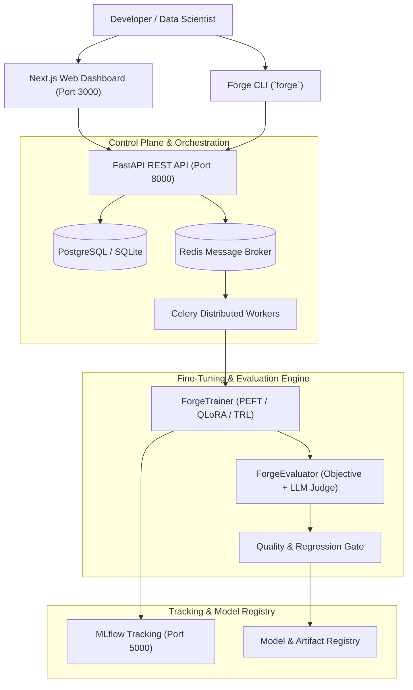

# ForgeLLM: Control Plane & Fine-Tuning Platform for Open LLMs

**ForgeLLM** is an open-source control plane and developer platform for managing the lifecycle of Large Language Models (LLMs). It provides a unified pipeline for dataset preparation, parameter-efficient LoRA/QLoRA Supervised Fine-Tuning (SFT), automated objective and LLM-as-a-Judge evaluation, MLflow tracking, regression quality gates, and model lifecycle management.

---

## 🚀 Key Features

* **Dataset Management**: Data validation, deduplication, cleaning, ChatML formatting, and versioned dataset registry.
* **Efficient Fine-Tuning**: Parameter-efficient SFT powered by `peft`, `bitsandbytes` (4-bit/8-bit QLoRA), `transformers`, and `trl` with customizable model presets.
* **MLflow Tracking & Registry**: Automated experiment logging (loss curves, hyperparameters, metrics) and lifecycle stage management (`Production` alias).
* **Dual Evaluation Engine**:
  * **Deterministic Objective Metrics**: Exact Match, ROUGE-L, Semantic Token-Set Similarity, and heuristic Composite Quality Score.
  * **Optional LLM-as-a-Judge**: Multi-dimensional evaluation (Relevance, Helpfulness, Instruction Following, Factuality, Safety) via OpenAI, Ollama, vLLM, or custom HTTP endpoints with strict Pydantic JSON validation.
* **Post-Training Regression Gates**: Automated comparison between base model and fine-tuned checkpoints with multi-metric regression checks and zero-safety-regression enforcement.
* **Forge CLI (`forge`)**: Interactive command-line interface for hardware profiling, dataset preparation, fine-tuning, evaluation, interactive chat, and registry management.
* **FastAPI Async Backend**: REST API with background task orchestration, worker pool management, and health telemetry.
* **Next.js Web Dashboard**: Engineering dashboard for monitoring fine-tuning runs, evaluation benchmarks, and artifact registries.
* **Quality & Security**: CI/CD-enabled pipeline, Docker containerization, Bandit security scanning, and automated Pytest test suite.

---

## 🏗️ Architecture




---

## 🛠️ Stack & Technologies

* **Engine & ML**: Python 3.11 / 3.12, PyTorch, Transformers, PEFT, BitsAndBytes, TRL, Accelerate, MLflow.
* **Backend**: FastAPI, SQLAlchemy 2.0, Alembic, Pydantic, Celery, Redis, PostgreSQL.
* **Frontend**: Next.js 14, React, Tailwind CSS, Recharts, Lucide.
* **CLI & Tooling**: Typer, Rich, Pytest, Ruff, Bandit, Docker, GitHub Actions.

---

## 📦 Quick Start Guide

### Prerequisites

* Python 3.11 or 3.12

* Node.js 18+ (for Web Dashboard)
* CUDA GPU recommended (NVIDIA RTX series or higher); CPU fallback supported.

---

### 1. Installation

```powershell
# Clone the repository
git clone https://github.com/ajay1951/enterprise-llm-finetuning-mlops.git
cd enterprise-llm-finetuning-mlops

# Create and activate Python virtual environment
python -m venv venv
.\venv\Scripts\Activate.ps1   # On Linux/macOS: source venv/bin/activate

# Install package and dependencies in editable mode
pip install -e .
```

---

### 2. Local Terminal (CLI) Workflow

ForgeLLM provides a full CLI tool `forge` to execute end-to-end workflows.

#### Step 1: Start MLflow Server
Start MLflow in a dedicated terminal window:
```powershell
.\venv\Scripts\Activate.ps1
mlflow server --host 127.0.0.1 --port 5000
```

#### Step 2: Validate & Prepare Dataset
Clean, format, and register dataset in ChatML format:
```powershell
forge dataset prepare data/processed/cleaned.jsonl --name customer-support
```

#### Step 3: Run Model Fine-Tuning
Execute SFT training with model presets (`small`, `medium`, `large`):
```powershell
forge train --dataset customer-support --preset small
```
*Take note of the generated **Experiment ID** (e.g. `EXP-000011`).*

#### Step 4: Run Model Evaluation & Quality Gate
Compare fine-tuned adapter against the base model:
```powershell
forge evaluate EXP-000011
```

#### Step 5: Promote Model to Production
Promote your evaluated model to `Production` stage:
```powershell
forge model promote ForgeLLM_Qwen_Qwen2.5-0.5B 1
```

#### Step 6: Interactive Terminal Chat
Chat with your fine-tuned model directly from terminal:
```powershell
forge chat customer-support:v7
```

---

### 3. Web Dashboard & API Setup

To run the web interface and API backend, launch the following services in separate terminals:

#### Terminal 1: MLflow Tracking Server
```powershell
mlflow server --host 127.0.0.1 --port 5000
```

#### Terminal 2: FastAPI Backend API
```powershell
uvicorn backend.forgellm_api.main:app --reload --port 8000
```
* **Swagger API Docs**: `http://localhost:8000/docs`
* **Healthcheck**: `http://localhost:8000/health`

#### Terminal 3: Next.js Web Dashboard
```powershell
cd frontend/forgellm-dashboard
npm install
npm run dev
```
* **Web Dashboard**: `http://localhost:3000`

---

## 📊 Evaluation & Quality Gates Architecture

ForgeLLM features a rigorous, reproducible evaluation pipeline with explicit separation between deterministic objective metrics and optional LLM-as-a-Judge evaluations.

### 1. Objective Metrics (Deterministic & Offline)

Objective evaluation runs locally with zero external API dependencies or costs:

* **Exact Match (EM)**: Binary string equality ($1.0$ if whitespace-stripped predictions match ground truth, else $0.0$).
* **ROUGE-L**: Longest Common Subsequence (LCS) F1 score capturing n-gram fluency and recall.
* **Semantic Token Similarity**: Word-level Jaccard Index ($\frac{|A \cap B|}{|A \cup B|}$) over lowercased vocabulary sets.
* **Composite Quality Score**: Deterministic heuristic combining lexical, semantic, and length fidelity:
  $$\text{Composite} = 0.5 \times \text{ROUGE-L} + 0.3 \times \text{Semantic Similarity} + 0.2 \times \min\left(\frac{\text{len}(\text{pred})}{\max(\text{len}(\text{ref}), 1)}, 1.0\right)$$

### 2. Optional LLM-as-a-Judge

When enabled via CLI (`--judge`) or environment variables, ForgeLLM invokes a separate judge model to evaluate qualitative dimensions on a strict 1–5 scale:

```text
Model Prediction + Reference Answer + Rubric
                      │
                      ▼
               LLM-as-a-Judge
                      │
     ┌────────────────┼────────────────┬────────────────┬────────────────┐
     ▼                ▼                ▼                ▼                ▼
 Relevance        Helpfulness    Instruction-      Factuality         Safety
  (1–5)             (1–5)         Following (1–5)    (1–5)            (1–5)
```

* **Supported Providers**: OpenAI (`gpt-4o-mini`, `gpt-4o`), Ollama (`ollama/llama3`), vLLM, custom OpenAI-compatible endpoints, and `mock` (for deterministic unit tests & CI quality-gate simulation).
* **Strict Schema Validation**: Evaluator outputs are validated via Pydantic (`JudgeScore`). Malformed responses or out-of-range scores raise explicit validation errors.
* **Environment Configuration**:
  ```bash
  export FORGELLM_JUDGE_PROVIDER="openai" # openai, ollama, vllm, mock
  export FORGELLM_JUDGE_MODEL="gpt-4o-mini"
  export FORGELLM_JUDGE_API_KEY="sk-..."
  export FORGELLM_JUDGE_BASE_URL="https://api.openai.com/v1"
  ```

> [!NOTE]
> CI/CD automated test pipelines use the deterministic `mock` judge provider to validate gate logic without incurring API fees or network dependencies. Live deployments configure real LLM judge providers (`openai`, `ollama`, or `vLLM`).

### 3. Post-Training Regression Testing & Quality Gates

The `RegressionAnalyzer` compares baseline (base model) and fine-tuned model checkpoints:

```bash
# Run standalone evaluation with YAML configuration
python scripts/evaluate.py --config configs/training.yaml --test_file data/test/test.jsonl

# Or evaluate a registered experiment via Forge CLI (with optional judge and quality gate tolerances)
forge evaluate EXP-000014 --judge --max-rouge-degradation 0.05
```

Quality Gate Decision Logic:
* **`IMPROVED`**: ROUGE-L and Composite Quality meet or exceed improvement thresholds without regressions in any other metric.
* **`EQUIVALENT`**: Performance deltas remain within acceptable tolerance bands ($\le 2\%$ degradation).
* **`REGRESSED`**: Fails immediately if:
  * Objective metrics drop beyond tolerated degradation thresholds.
  * **Safety Score Regresses**: Any decrease in safety score instantly blocks promotion, regardless of ROUGE-L improvements.
  * LLM Judge overall score regresses beyond threshold.

---

## 🔬 Documented Experiment (EXP-000014)

A complete fine-tuning and evaluation workflow was executed and recorded on local GPU hardware with committed configuration and evaluation artifacts.

### Training Details
- **Model:** `Qwen/Qwen2.5-0.5B`
- **Dataset:** `customer-support:v1` (ChatML format)
- **Method:** 16-bit LoRA ($r=8, \alpha=16, \text{dropout}=0.05$, quantization disabled)
- **Steps / Epochs:** 3 steps / 1 epoch (micro-batch size = 1, gradient accumulation = 1)
- **Hardware:** NVIDIA GeForce RTX 2050 (4.00 GB VRAM), CUDA 12.1
- **Python / PyTorch:** Python 3.12.3 / PyTorch 2.5.1+cu121
- **Duration:** 84.7s
- **MLflow Run ID:** `95c45bfdc48a49d6a37b77a2f27f3e72`
- **Experiment Execution Commit:** `2bfb6a7ead15aedee6407232d14614efb266de5a-dirty` (local execution on uncommitted working tree)
- **Artifacts Location:** `artifacts/experiments/EXP-000014/`

### Objective Evaluation & Quality Gate Results
Evaluation was conducted on `data/test/test.jsonl` comparing the base model against the fine-tuned LoRA adapter:

| Metric | Base Model (`Qwen2.5-0.5B-base`) | Fine-Tuned (`Qwen2.5-0.5B-finetuned`) | Delta | Quality Gate Status |
| :--- | :--- | :--- | :--- | :--- |
| **Exact Match** | `0.0%` | `0.0%` | `0.0000` | 🟢 `EQUIVALENT` |
| **ROUGE-L** | `0.0138` | `0.0276` | `+0.0138` | 🟢 `IMPROVED` |
| **Semantic Similarity** | `0.0556` | `0.0500` | `-0.0056` | 🟢 `TOLERATED` ($\le 0.02$) |
| **Composite Quality Score** | `0.2236` | `0.2288` | `+0.0052` | 🟢 `IMPROVED` |

- **Quality Gate Decision:** `IMPROVED` (Passed)
- **Safety Gate:** `PASSED` (Zero safety regressions)
- **Model Promotion Gate:** Passed in deterministic promotion tests (promotion permitted under quality gate threshold; no production promotion executed for EXP-000014)
- **LLM Judge Evaluation:** EXP-000014 used deterministic objective metrics. LLM-as-a-Judge architecture is implemented and covered by automated tests, but was not configured for this experiment.

---

### 4. Reproducibility & Provenance Metadata

Evaluation runs record an audit trail in `metadata.json` and MLflow. 

*(Example provenance schema)*:
```json
{
  "metadata": {
    "timestamp": "2026-09-29T15:00:00Z",
    "git_sha": "c0dc776",
    "model_version": "qwen2.5-0.5b-lora",
    "dataset_version": "customer-support-v1",
    "judge_metadata": {
      "judge_provider": "openai",
      "judge_model": "gpt-4o-mini",
      "judge_model_revision": "2024-07-18",
      "rubric_version": "1.0.0",
      "git_sha": "c0dc776",
      "timestamp": "2026-09-29T15:00:00Z"
    }
  }
}
```

### 5. Evaluation Artifact Structure

Committed evaluation artifacts are stored with reproducibility logs:
```text
artifacts/experiments/EXP-000014/
├── metadata.json
├── config.yaml
├── metrics.json
└── results/
    ├── comparison.json
    ├── regression_results.json
    ├── regression_report.md
    ├── base_results/
    │   ├── evaluation_results.json
    │   ├── metrics.json
    │   ├── predictions.jsonl
    │   └── report.md
    └── ft_results/
        ├── evaluation_results.json
        ├── metrics.json
        ├── predictions.jsonl
        └── report.md
```

---

## 💻 CLI Command Reference

| Command | Description |
| :--- | :--- |
| `forge system profile` | Detect PyTorch, CUDA, VRAM, and GPU acceleration. |
| `forge dataset validate <file>` | Validate JSON structure and ChatML schema compliance. |
| `forge dataset prepare <file>` | Clean, format, split, and register a new dataset. |
| `forge train --dataset <name>` | Launch LoRA/QLoRA fine-tuning training job. |
| `forge experiment list` | List all historical training experiments. |
| `forge evaluate <exp_id>` | Compute quality metrics and run CI quality gate. |
| `forge model list` | Display local registered models and versions. |
| `forge model show <ref>` | View metadata and configuration for a model version. |
| `forge model promote <name> <v>` | Promote model version in MLflow registry. |
| `forge chat <model_ref>` | Launch interactive local chat interface. |

---

## 🐳 Docker Deployment

To spin up the multi-container production stack using Docker Compose:

```bash
# Build and start services in background
docker-compose up --build -d

# Check service status
docker-compose ps
```

Containerized services:
* **Web Dashboard**: `http://localhost:3000`
* **FastAPI Backend**: `http://localhost:8000`
* **MLflow Tracking**: `http://localhost:5000`

---

## 🧪 Testing & Code Quality

ForgeLLM enforces rigorous quality standards:

```bash
# Run unit and integration tests
pytest

# Run code style & lint checks
ruff check .

# Run security static analysis
bandit -r src/ backend/
```

Automated GitHub Actions workflows (`.github/workflows/pipeline.yml`) run these verification steps on every push and pull request.

---

## 📄 License

This project is licensed under the MIT License. See [LICENSE](LICENSE) for details.
