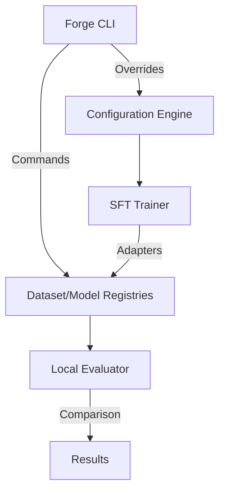
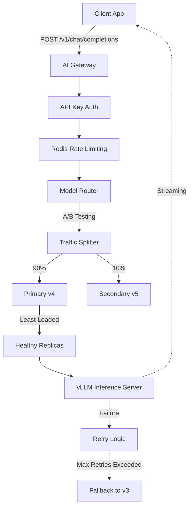

# ForgeLLM

ForgeLLM is a robust, local LLM fine-tuning and evaluation platform.
Phase 2 transforms ForgeLLM from a collection of ML scripts into a **professional local LLM fine-tuning CLI and experiment-management system**.

## Architecture Overview



## Features Complete in Phase 2
- **Hardware Profiling:** Automatic PyTorch/CUDA detection and hardware validation (`forge system profile`).
- **Dataset Registry & Versioning:** Automatically clean, validate, format, and version datasets (`forge dataset prepare data.jsonl`).
- **Configuration Precedence:** Deep-merge configuration (Defaults -> YAML -> Preset -> CLI args).
- **Experiment Tracking:** Tracks `EXP-XXXXXX` jobs with model, datasets, method, and durations.
- **Model Registry:** Links trained LoRA adapters back to their source models and datasets.
- **Evaluation:** Compare base vs fine-tuned responses side-by-side (`forge evaluate EXP-XXXXXX`).
- **Inference CLI:** Seamless local chat interface with your trained LoRA adapter (`forge chat model:v1`).

## CLI Usage

### System
```bash
forge version
forge system info
forge system profile
```

### Dataset
```bash
forge dataset validate data/raw/train.jsonl
forge dataset prepare data/raw/train.jsonl --name customer-support
forge dataset list
forge dataset info customer-support
```

### Training
```bash
forge train --dataset customer-support:v1 --preset small
```

### Experiments
```bash
forge experiment list
forge experiment show EXP-000001
forge experiment compare EXP-000001 EXP-000002
```

### Model
```bash
forge model list
forge model show customer-support:v1
```

### Evaluation & Inference
```bash
forge evaluate EXP-000001
forge chat customer-support:v1
```

## Phase 10: AI Gateway & Production Operations

The **AI Gateway** adds a robust production serving layer to ForgeLLM, allowing it to act as an intelligent, OpenAI-compatible proxy to your fine-tuned models.

### Gateway Architecture


### Key Gateway Features
- **OpenAI-Compatible API:** Drop-in replacement for OpenAI endpoints (`/v1/chat/completions`) with full streaming support (`Server-Sent Events`).
- **Intelligent Routing:** Supports `ROUND_ROBIN`, `LEAST_LOADED`, and `WEIGHTED` strategies.
- **Resilience:** Implements exponential backoff, retries, and automatic failover (fallback) to older model versions if primary replicas degrade.
- **A/B Testing:** Safely route a percentage of traffic to STAGED models before full production promotion.
- **High-Performance Telemetry:** Buffers TTFT (Time-to-First-Token), Latency, and Tokens/sec in Redis before batching to the database.
