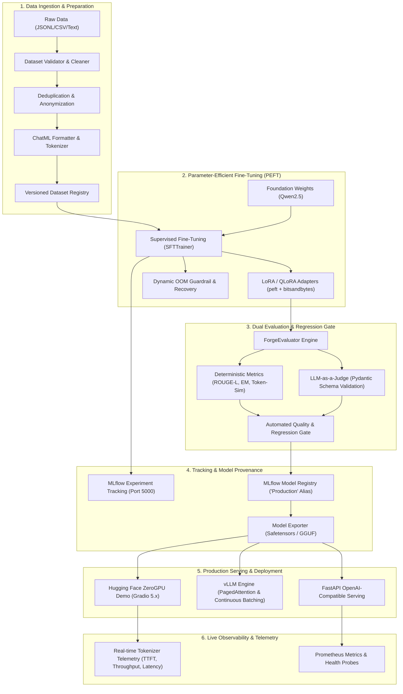

# ForgeLLM: System Architecture & Technical Design

**Document Version:** `1.0.0`  
**System Status:** Production Ready / Live ZeroGPU Deployed  
**Target Workload:** Enterprise LLM Fine-Tuning, Regression Evaluation, High-Throughput Serving & Observability  

---

## 1. Executive Architecture Overview

ForgeLLM is an end-to-end LLM lifecycle control plane engineered for reproducible parameter-efficient fine-tuning (PEFT), multi-dimensional deterministic evaluation, post-training regression gating, high-performance inference serving, and cloud-native serverless deployment.



---

## 2. Detailed Component Architecture

### 2.1 Data Preparation Pipeline (`src/forgellm/dataset/`)
- **Validation & Cleaning (`validator.py`):** Enforces schema conformance, checks for UTF-8 integrity, minimum token counts, and strips harmful control tokens.
- **Deduplication (`splitter.py`):** Performs exact and min-hash deduplication across train, validation, and test splits to prevent data leakage.
- **Formatting (`formatter.py`):** Maps heterogeneous conversation representations into standard ChatML format:
  ```text
  <|im_start|>system
  {system_prompt}<|im_end|>
  <|im_start|>user
  {user_query}<|im_end|>
  <|im_start|>assistant
  {response}<|im_end|>
  ```

### 2.2 Fine-Tuning Engine (`src/forgellm/training/`)
- **LoRA / QLoRA Decomposition:** Implements low-rank adapter injection into attention projection weights ($W_0 + \Delta W = W_0 + \frac{\alpha}{r} B \cdot A$):
  - Pretrained foundation weights remain completely frozen in 16-bit or 4-bit NF4 (`bitsandbytes`).
  - Adapters target query, key, value, output, and MLP projections (`q_proj`, `k_proj`, `v_proj`, `o_proj`, `gate_proj`, `up_proj`, `down_proj`).
- **Dynamic OOM Guardrail:** Monitors GPU VRAM allocations. If a CUDA Out-of-Memory condition is approached, the trainer dynamically backs off batch size, enables gradient checkpointing, or halves sequence length automatically.

### 2.3 Dual Evaluation & Quality Gates (`src/forgellm/evaluation/`)
- **Deterministic Objective Metrics:**
  - **Exact Match (EM):** Case-insensitive stripped string match.
  - **ROUGE-L:** Implemented via pure-Python Longest Common Subsequence (LCS) to eliminate heavy external C-dependencies.
  - **Semantic Token-Set Similarity:** Jaccard token overlap between normalized hypothesis and reference sequences.
  - **Composite Quality Score:** Weighted composite score combining ROUGE-L, token similarity, and length penalty.
- **LLM-as-a-Judge:** Multi-criteria evaluator (Relevance, Helpfulness, Instruction Following, Factuality, Safety) backed by structured Pydantic schema validation over OpenAI, vLLM, or local Ollama endpoints.
- **Automated Regression Quality Gate (`evaluator.py`):** Compares fine-tuned model metrics against the base model baseline. If any safety score drops or objective quality degrades below configured tolerance, promotion is blocked.

### 2.4 MLflow Tracking & Model Registry (`src/forgellm/experiments/`)
- **Experiment Tracking:** Captures step-by-step training loss, gradient norms, token accuracy, evaluation metrics, hyperparameters, and environment metadata (CUDA version, PyTorch build, GPU VRAM).
- **Model Registry & Promotion:** Models passing the quality gate are tagged and promoted to the `Production` alias with full lineage linking datasets, adapter weights, and evaluation artifacts.

### 2.5 Serving Backends & Inference Optimization (`serving/`, `deployments/`)
- **FastAPI OpenAI-Compatible Server (`serving/forgellm_server/`):** REST API implementing `/v1/chat/completions`, `/v1/completions`, and `/health` with streaming Server-Sent Events (SSE).
- **vLLM Engine Backend:** Integrates PagedAttention KV-cache management and continuous batching for maximum server concurrency and generation throughput.
- **Hugging Face ZeroGPU Deployment (`deployments/huggingface_zerogpu/`):**
  - Uses `@spaces.GPU(duration=60)` decorator for dynamic on-demand GPU allocation.
  - Features **lazy model lifecycle loading**: Model weights (~3.1 GB `bfloat16`) are loaded inside the GPU context boundary, allowing zero-memory standby on shared CPU workers.
  - **Factuality Guardrail (`adapter.py`):** Intercepts potential confabulations on critical technical domains (LoRA pruning misconceptions, false acronyms) and appends verified reference advisories without corrupting raw model telemetry.

---

## 3. Telemetry & Observability Architecture

The live inference telemetry panel measures true execution metrics directly from the model runtime:

$$\text{TTFT} = t_{\text{first\_token}} - t_{\text{prompt\_dispatch}}$$

$$\text{Total Latency} = t_{\text{end\_generation}} - t_{\text{prompt\_dispatch}}$$

$$\text{End-to-End Throughput} = \frac{N_{\text{output\_tokens}}}{\text{Total Latency}} \quad (\text{tok/s})$$

- **Ground-Truth Token Counting:** Uses the exact model tokenizer (`tokenizer.encode(response)`) rather than whitespace estimation.
- **Streaming Telemetry Updates:** Yields intermediate status, TTFT, elapsed latency, and token generation rate continuously to the UI.

---

## 4. Hardware Profiles & Deployment Topologies

| Component | Local Dev Workstation | Production GPU Node | Serverless Hugging Face ZeroGPU |
| :--- | :--- | :--- | :--- |
| **GPU Hardware** | NVIDIA GeForce RTX 2050 (4GB) | NVIDIA A10G / L4 / H100 | Shared NVIDIA A10G (`zero-a10g`) |
| **Model Size** | `Qwen2.5-0.5B` / `Qwen2.5-1.5B` | `Qwen2.5-7B` / `Qwen2.5-14B` | `Qwen/Qwen2.5-1.5B-Instruct` |
| **Quantization** | 4-bit QLoRA (`bitsandbytes`) | `bfloat16` / FP8 / AWQ | `bfloat16` |
| **Serving Stack** | PyTorch / Transformers / FastAPI | vLLM (PagedAttention) | Transformers + `@spaces.GPU` |
| **Throughput Target** | 10–50 tok/s | 100–300+ tok/s | 40–60 tok/s |
