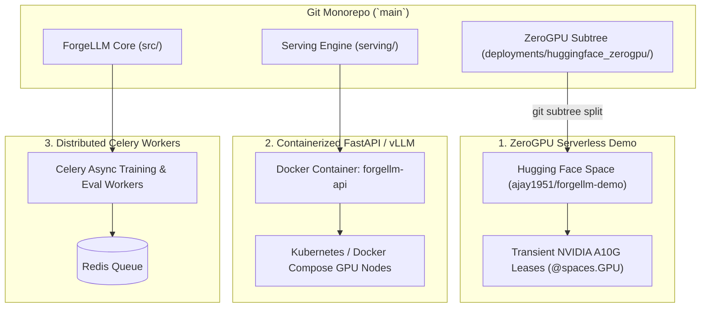

# ForgeLLM: Deployment & Release Engineering Guide

**Document Version:** `1.0.0`  
**Target Workload:** Production GPU Serving, Hugging Face ZeroGPU Serverless, and Docker Orchestration  

---

## 1. Deployment Topology Overview

ForgeLLM supports three deployment modalities:



---

## 2. Hugging Face ZeroGPU Deployment Pipeline

### Why Subtree Splitting?
Hugging Face Spaces expects the application entry point (`app.py`, `requirements.txt`, `README.md`) at the root of the Space repository. ForgeLLM maintains the ZeroGPU application in `deployments/huggingface_zerogpu/` to preserve monorepo integrity, automated CI/CD testing, and unified version control.

### Step-by-Step Deployment Workflow

1. **Verify Local Quality Gates:**
   ```bash
   pytest tests/ -v
   ruff format --check src/ tests/ deployments/
   ruff check src/ tests/ deployments/
   ```

2. **Split and Push Deployment Subtree:**
   ```bash
   # Extract deployment directory into a standalone git tree commit
   $split = git subtree split --prefix deployments/huggingface_zerogpu main

   # Force push directly to the Hugging Face Space git remote
   git push hf-space ${split}:main --force
   ```

3. **Verify Space Health:**
   Check Space status via the Hugging Face API:
   ```bash
   python -c "
   import urllib.request, json
   req = urllib.request.Request('https://huggingface.co/api/spaces/ajay1951/forgellm-demo')
   with urllib.request.urlopen(req) as r:
       print('Stage:', json.loads(r.read())['runtime']['stage'])
   "
   ```
   Expected status: `RUNNING` on `zero-a10g`.

---

## 3. ZeroGPU Runtime Lifecycle & Memory Optimization

### Transient GPU Leasing (`@spaces.GPU(duration=60)`)
ZeroGPU allocates NVIDIA A10G GPUs dynamically on a per-request basis. When no generation requests are active, the container runs on shared CPU workers at zero GPU cost.

### Lazy Model Loading Pattern
To prevent cold-start out-of-memory errors on CPU workers:
- The `ZeroGPUInferenceEngine` defers model weight instantiation (~3.1 GB `bfloat16`) until the execution context enters the `@spaces.GPU` boundary.
- If CUDA is unavailable (e.g. during local developer testing or CPU warmup), the engine seamlessly falls back to CPU float32 execution without crashing.

---

## 4. Rollback & Disaster Recovery Strategy

If a newly deployed feature branch triggers regression or latency degradation in production:

1. **Immediate Rollback to Known Good Commit:**
   ```bash
   # Split verified release tag/commit
   $split = git subtree split --prefix deployments/huggingface_zerogpu v1.0.0
   git push hf-space ${split}:main --force
   ```

2. **Verify Space Recovery:**
   Execute the live evaluation suite (`scratch/run_live_suite.py`) to confirm latency and throughput metrics return to nominal baselines ($< 0.5s$ TTFT, $> 40 \text{ tok/s}$).

---

## 5. Security & Credential Management

- **No Stored Hub Credentials:** The repository contains zero hardcoded API tokens or secrets.
- **Git Push Security:** ZeroGPU git deployment uses transient OAuth or user-level PAT tokens passed via secure CLI environment variables.
- **Input Sanitization:** Prompts are stripped of unauthorized ChatML control tokens (`<|im_start|>`, `<|im_end|>`) to prevent prompt injection attacks.
