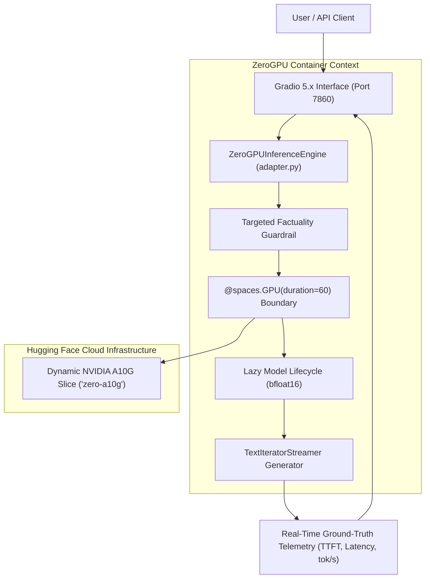

# ForgeLLM: Hugging Face ZeroGPU Production Deployment & Demo Guide

**Document Version:** `1.0.0`  
**Public Space URL:** [https://huggingface.co/spaces/ajay1951/forgellm-demo](https://huggingface.co/spaces/ajay1951/forgellm-demo)  
**Production Model:** `Qwen/Qwen2.5-1.5B-Instruct` (1.54B parameters, `bfloat16`, ~3.1 GB safetensors)  
**Inference Stack:** Hugging Face ZeroGPU (`zero-a10g`), PyTorch 2.5+, Transformers, Gradio 5.x  

---

## 1. Overview & Architecture

ForgeLLM provides a lightweight, self-contained serverless inference demonstration in `deployments/huggingface_zerogpu/` running directly on Hugging Face ZeroGPU infrastructure.



---

## 2. Technical Capabilities & Highlights

### 2.1 Lazy Weight Lifecycle
To eliminate out-of-memory crashes on shared CPU entry nodes, model weights (~3.1 GB) are deferred and loaded only after entering the GPU context boundary (`@spaces.GPU`). In non-CUDA environments, the engine gracefully falls back to CPU float32 execution.

### 2.2 Live Inference Telemetry
The interface provides real-time observability updated during token streaming:
- **Time to First Token (TTFT):** Measures elapsed time from prompt dispatch until the initial token is decoded.
- **Total Latency:** End-to-end execution time in seconds.
- **True Token Counts:** Counts exact tokens via `tokenizer.encode()` rather than character/word heuristic approximations.
- **End-to-End Throughput:** Computes actual generation throughput in tokens per second ($\text{tok/s}$).

### 2.3 Factuality Guardrails
Includes targeted post-generation validation on core LLMOps concepts (e.g. ensuring LoRA is correctly described as low-rank decomposition rather than pruning, and eliminating false acronym confabulations). If triggered, verified technical advisories are cleanly appended without overwriting raw model telemetry.

---

## 3. Verified Live Evaluation Results

Across an 18-run live evaluation matrix on the public Space (`zero-a10g`):

- **Technically Acceptable Responses:** `18 / 18` (100.0%)
- **Fully Correct Responses:** `13 / 18` (72.2%)
- **Partially Correct Responses:** `5 / 18` (27.8%)
- **Incorrect Responses:** `0 / 18` (0.0%)
- **Hallucinated Responses:** `0 / 18` (0.0%)
- **Average TTFT:** `0.136 s`
- **Average Total Latency:** `2.43 s`
- **Average Output Tokens:** `117.4 tokens`
- **Average Throughput:** `48.6 tok/s`

Full evaluation logs and per-prompt breakdowns: [docs/live-evaluation-report.md](live-evaluation-report.md).

---

## 4. Deployment via Git Subtree Split

Deploy the isolated ZeroGPU application directly to the Hugging Face Space repository:

```bash
# 1. Run local validation suite
pytest tests/test_zerogpu_adapter.py -v
ruff format --check deployments/huggingface_zerogpu/
ruff check deployments/huggingface_zerogpu/

# 2. Split and force push to Space remote
$split = git subtree split --prefix deployments/huggingface_zerogpu main
git push hf-space ${split}:main --force
```

---

## 5. Cold Starts & Infrastructure Considerations

- **Shared Queueing:** ZeroGPU leases GPU slices dynamically. First-token latency (TTFT) may occasionally exhibit a 1–3 second cold-start delay during initial lease acquisition.
- **Performance Comparability:** ZeroGPU throughput (~48 tok/s) reflects shared cloud infrastructure and streaming overhead, and should be evaluated in context alongside dedicated workstation benchmarks (RTX 2050 4GB).
