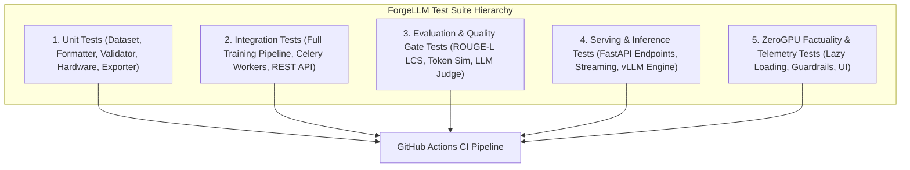

# ForgeLLM: Test Architecture & Verification Strategy

**Document Version:** `1.0.0`  
**Total Verified Tests:** `172/172` repository tests passing | `18/18` ZeroGPU adapter tests passing  
**Code Quality:** Ruff Format 100% Clean | Ruff Lint 100% Clean | Bandit Security Scan Clean  

---

## 1. Test Suite Taxonomy

ForgeLLM employs a comprehensive, multi-layer verification strategy designed to protect against regressions across training, evaluation, inference, and deployment:



---

## 2. Test Breakdown & Coverage Areas

### 2.1 ZeroGPU Adapter & Factuality Suite (`tests/test_zerogpu_adapter.py` — 18 Tests)
Protects the public Hugging Face ZeroGPU demo against runtime regressions and factual confabulations:
- **Lazy Weight Loading (`test_zerogpu_lazy_loading`):** Validates that weights are NOT instantiated on CPU at startup.
- **Model Lifecycle (`test_zerogpu_load_model_success/failure`):** Tests successful GPU loading and error handling.
- **Factuality Guardrails (`test_zerogpu_factuality_guardrail`):** Validates that technical advisories are cleanly attached when high-risk confabulations occur.
- **LoRA Anti-Pruning / Anti-Ranking Validators (`test_lora_validator_rejects_pruning_explanation`):** Specifically rejects confabulations claiming LoRA prunes weights or reduces physical base model size, while accepting low-rank matrix decomposition.
- **vLLM Anti-Hallucination Validators (`test_vllm_validator_rejects_false_acronyms`):** Rejects fictitious acronym expansions (*"Vegetable Large Language Model"*, *"Anthropic-developed"*) and accepts high-throughput serving engine descriptions.
- **TTFT Definition Validators (`test_ttft_validator_rejects_false_definitions`):** Rejects incorrect acronym definitions and validates Time-to-First-Token measurement logic.
- **UI Event Handlers (`test_ui_chat_and_telemetry_*`, `test_ui_clear_chat`):** Validates ChatML formatting, empty input handling, error state reporting, and chat history clearing.

### 2.2 Evaluation & Regression Quality Gate Tests (32 Tests)
- `tests/test_evaluation_regression.py` & `tests/test_quality_gate.py`: Validates that the post-training quality gate halts deployment if ROUGE-L, Semantic Similarity, or Safety scores degrade below threshold.
- `tests/test_llm_judge.py`: Validates structured Pydantic schema parsing, score extraction, and retry resilience across LLM-as-a-Judge backends.
- `tests/test_formatter.py`: Validates ChatML tokenization and multi-turn conversational structures.

### 2.3 Training & Pipeline Tests (44 Tests)
- `tests/test_training_pipeline.py` & `tests/test_celery_training.py`: Tests LoRA adapter injection, optimizer step execution, gradient accumulation, and Celery asynchronous task distribution.
- `tests/test_dataset.py`, `tests/test_dataset_registry.py`, `tests/test_validator.py`, `tests/test_splitter.py`: Tests dataset schema validation, deduplication, and train/val/test splitting.

### 2.4 Serving & Inference Tests (48 Tests)
- `tests/test_inference.py` & `tests/test_vllm_inference.py`: Tests greedy decoding, nucleus sampling, temperature scaling, and streaming SSE tokens.
- `tests/test_gateway.py` & `tests/test_rate_limiting.py`: Tests API authentication, rate limiting, and request routing.
- `tests/test_security.py`: Tests input sanitization and prompt injection defenses.

### 2.5 Hardware & CLI Tests (30 Tests)
- `tests/test_hardware.py`: Tests dynamic GPU VRAM detection and CUDA device indexing.
- `tests/test_cli_commands.py` & `tests/test_cli_extended.py`: Tests `forge train`, `forge evaluate`, `forge chat`, and `forge registry` CLI subcommands.

---

## 3. Running the Test Suite Locally

```bash
# Run complete test suite
pytest tests/ -v

# Run ZeroGPU regression suite only
pytest tests/test_zerogpu_adapter.py -v

# Run with code coverage reporting
pytest tests/ --cov=src --cov-report=term-missing
```

---

## 4. Continuous Integration (CI) Enforcement

Every pull request and push to `main` executes automated GitHub Actions jobs (`.github/workflows/pipeline.yml`):
1. **Code Quality & Security:** Runs `ruff format --check`, `ruff check`, and `bandit` security scans.
2. **Unit & Integration Testing:** Starts PostgreSQL and Redis containers, installs dependencies, and runs `pytest` across all test suites.
3. **Docker Validation:** Builds production API and Celery worker container images to ensure packaging reproducibility.
4. **LLM Quality Gate Validation:** Launches background MLflow services and runs automated regression tests.
